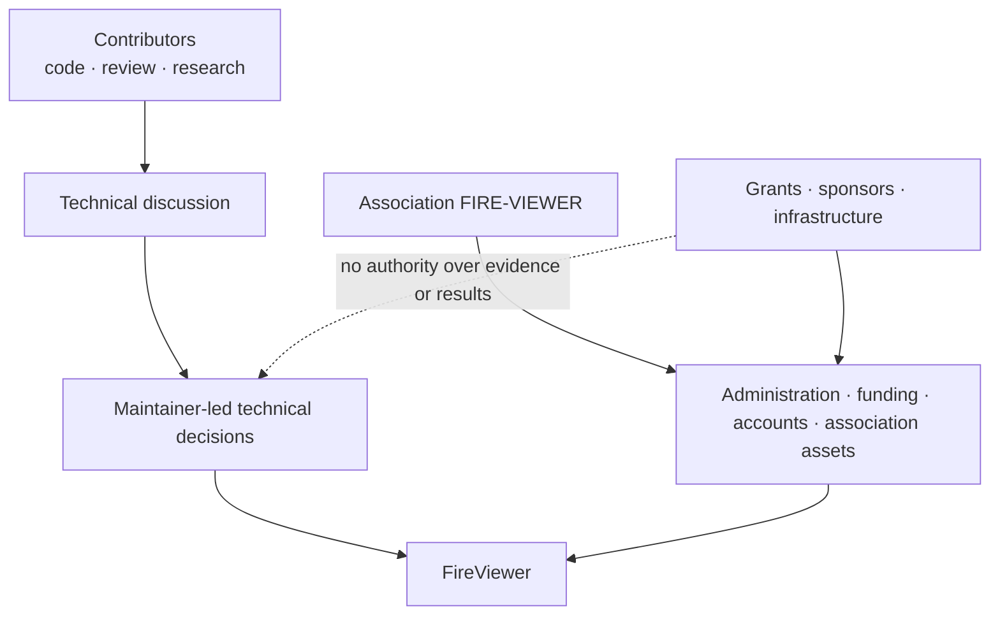

# FireViewer governance

FireViewer is still a small project. Its governance therefore remains simple,
explicit and proportionate to the people actually doing the work.

Technical development is currently led primarily by one maintainer. The French
non-profit association FIRE-VIEWER provides administrative and financial
stewardship for association-controlled resources.

These roles are related but not interchangeable.

## Structure

## Technical responsibility

The technical maintainer currently has primary responsibility for:

- architecture and public contracts;
- accepting or rejecting code contributions;
- releases and compatibility;
- evidence, provenance and uncertainty rules;
- security and privacy boundaries;
- separating experimental, implemented and accepted capabilities.

Changes affecting the meaning of evidence, geography, reconstruction,
publication, data retention, licensing or real/synthetic separation require an
explicit technical record and appropriate review.

## Association responsibility

The association is responsible for its own:

- administration and statutory decisions;
- bank accounts, budgets, expenses and grants;
- contracts and partnerships entered into in its name;
- association-controlled domains, accounts, data and infrastructure;
- assets formally assigned, purchased or licensed to it;
- legal and regulatory obligations.

The association does not automatically own software, data, models, brands or
other assets created before it existed. Those assets require an explicit
licence, assignment, contribution or other documented arrangement.

## Conflicts of interest

A decision involving the founder, technical maintainer or a related personal
activity must be documented. The interested person must not approve their own
reimbursement, contract, licence or other direct benefit.

The relevant decision should identify:

- the asset, service or expense concerned;
- the parties and their roles;
- the applicable licence or contract;
- the association interest;
- the abstention or independent validation used;
- the resulting record or agreement.

## Evidence and safety

No maintainer, association officer, contributor, sponsor or external AI system
can bypass FireViewer's evidence rules by assertion alone.

In particular:

- uncertainty must remain visible;
- model output must not overwrite source evidence;
- synthetic information must not become evidence of a real event;
- reconstruction must not be labelled as direct observation;
- publication gates must not be bypassed for convenience;
- FireViewer must not be presented as a future-propagation predictor.

## Contributions and disagreement

Technical disagreement is useful when it is supported by reproducible tests,
clear reasoning, stronger sources or a better implementation. Authority does
not convert an unsupported claim into evidence.

Maintainer access can expand when regular contributors demonstrate reliable
work and understanding of the component concerned. Permissions should initially
remain limited to the relevant technical area.

## Funding independence

Funding can influence which work becomes possible sooner. It cannot determine
what evidence says, hide uncertainty, convert a failed benchmark into a success
or promote an unqualified capability.

## Shared resources and continuity

Association-controlled repositories, domains, credentials and infrastructure
must have documented recovery and continuity procedures. Personal and
association accounts must remain distinguishable. Important transfers of
stewardship or ownership require a written record.

## Contact

**contact@fire-viewer.fr**
