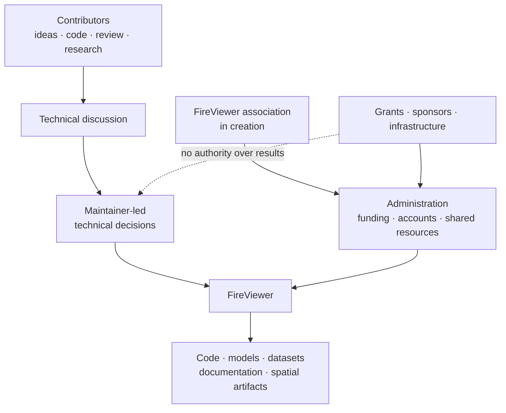

# How FireViewer is currently run

FireViewer is still a young project, and its governance is deliberately simple.

I started the project and currently maintain most of it myself.

There is no large contributor community, no technical committee and no reason
to pretend otherwise.

Today, most technical decisions are therefore maintainer-led.

That does not mean outside ideas are secondary. If somebody finds a better way
to solve a problem, reproduces an issue, challenges an assumption or
contributes something useful, I want that discussion to happen.

The important part is that changes affecting evidence, geography,
reconstruction or publication remain explainable.

FireViewer was built around the idea that uncertainty should not disappear just
because a cleaner answer would be more convenient. I do not want project
governance to work differently.

## Current structure

The administrative and technical sides are related, but they do not have the
same role.

## Technical decisions

The founding maintainer currently has final responsibility for:

- repository administration;
- accepting or rejecting contributions;
- architecture and public contracts;
- releases;
- evidence and provenance rules;
- security and privacy boundaries;
- maintaining the distinction between experimental and accepted capabilities.

Routine and reversible implementation choices do not need a formal governance
process.

Changes that alter the meaning of FireViewer should receive more explicit
discussion and leave a public record when practical.

That includes changes to:

- what counts as evidence;
- geographic truth and uncertainty;
- reconstruction semantics;
- publication gates;
- data retention;
- licensing;
- real/synthetic separation;
- compatibility-sensitive spatial packages.

## The association

A French non-profit association is currently being created around FireViewer.

Its first role is practical:

- provide administrative continuity;
- manage funding and shared expenses;
- hold shared project resources where appropriate;
- make grants and partnerships easier to manage;
- reduce the amount of infrastructure depending indefinitely on one person's
  private accounts.

It is not intended to suddenly turn technical decisions into votes or to
create an artificial board above the people actually doing the technical work.

For now, technical governance remains maintainer-led.

If FireViewer eventually attracts regular contributors and additional
maintainers, governance should evolve with that reality.

## Contributions and disagreement

Technical disagreement is useful.

A contributor does not need to agree with an existing design simply because I
wrote it.

A reproducible counter-example, better implementation, stronger source or
well-explained criticism is useful project input.

Evidence and reasoning should matter more than seniority.

## Evidence and safety

No maintainer, association officer, contributor, sponsor or external AI system
can bypass FireViewer's evidence rules just by asserting that a result is
correct.

In particular:

- uncertainty must not be hidden to obtain a cleaner result;
- synthetic information must not become real-event evidence;
- model output must not silently mutate source evidence;
- review or publication gates must not be bypassed for convenience.

Changing these principles is a project-level governance and architecture
decision.

## Funding independence

A grant, sponsor or infrastructure provider does not buy authority over
FireViewer's technical conclusions.

Funding can influence which work becomes possible sooner.

It must not change:

- what evidence says;
- whether uncertainty is shown;
- whether a result passed validation;
- whether synthetic information is labelled synthetic;
- whether something is described as operational when it is not.

## Becoming a maintainer

There is currently no contribution-count formula.

If contributors become regularly involved, maintainer access can be extended
based on demonstrated work, reliability and understanding of the relevant
component.

Permissions can initially remain limited to that technical area.

If FireViewer becomes a genuinely multi-maintainer project, this document
should be rewritten to describe that project instead of preserving today's
structure forever.

## Shared resources

Repositories, domains, infrastructure accounts, project identity and other
shared resources should be managed for FireViewer's continuity rather than the
private benefit of one contributor.

Important transfers of stewardship should be documented.

## One rule for governance

**The governance should reflect the project that actually exists, not imitate
the governance of a larger project we do not have yet.**

## Contact

**unicornwhodev@gmail.com**
