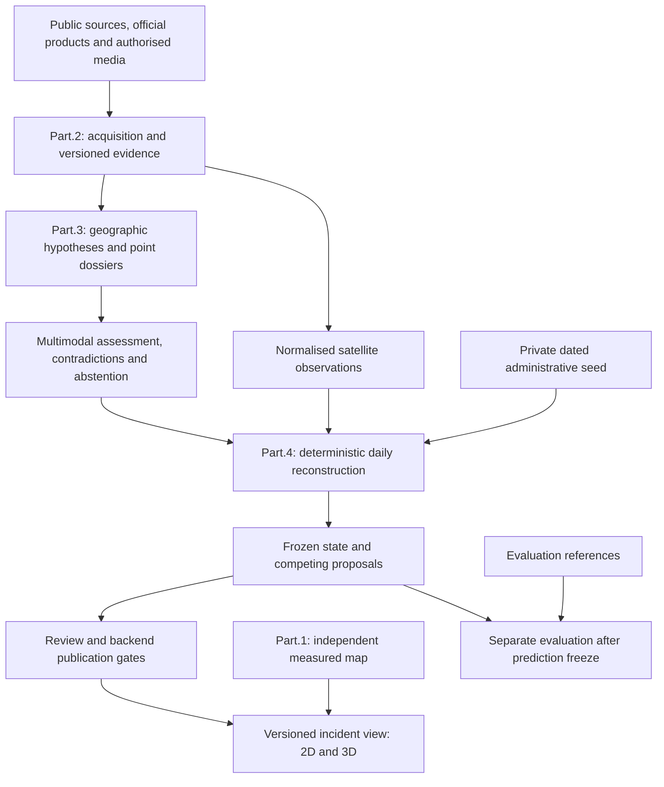

# FireViewer

**Evidence-centred infrastructure for documenting, reviewing, mapping and studying wildfire events.**

FireViewer is an independent research and engineering project maintained by **Unicorn Who Dev**. It combines public and official sources, authorised contributions, deterministic geographic processing, machine-assisted analysis and human review while keeping provenance, uncertainty and revision history explicit.

> FireViewer is not an emergency alert service, an official wildfire source, an incident-command system or a certified fire-propagation predictor. In an emergency, follow the competent authorities and emergency services.

## Purpose

Wildfire information is fragmented across official bulletins, public reporting, photos, videos, satellite products, maps and first-hand contributions. FireViewer is designed to preserve the relationship between a published claim and the evidence used to support it.

The project aims to provide:

- incident records with source-backed facts and dated revisions;
- visual and geographic evidence with immutable provenance references;
- geographic candidates with uncertainty, contradiction and review status;
- observed and reconstructed temporal geographic layers;
- reproducible measured-map packages for exploration and post-event study;
- explicit abstention when the available evidence is insufficient.

## System at a glance

This graph describes component responsibilities and data boundaries, not a claim that every branch is enabled or accepted end to end. Evaluation references never feed the reconstruction branch.

Detectors identify image regions; they do not create geographic truth. Geographic candidates are produced by a separate deterministic stage using documented camera position and accuracy, orientation and field of view when available, terrain, maps, satellite references and earlier reviewed event states.

The final multimodal supervisor may support, reject or abstain on a supplied candidate. It may not silently replace the original point. Publication remains a backend policy decision.

## Current deterministic fire-state reconstruction

The active documented reconstruction is **Part.4 3.3**, algorithm line `3.3.0`. It normalises georeferenced observations onto an adaptive EPSG:2154 probability grid and derives EPSG:4326 `affected`, `active` and uncertainty products.

The current baseline fusion profile is `part4-framed-v1` (version `1.0.0`). It is explicitly **uncalibrated**, so its output remains ineligible for unattended publication. Calibration and holdout evaluation are isolated workflows and a future qualified profile must pass the documented gates before it can authorise any automatic component update.

Initialization is a private dated affected contour, not an active-area assertion. Checkpoints retain probability grids and lineage; corrections append revisions without silently rewriting history. Seed-conditioned historical reconstruction is distinct from autonomous discovery, live-provider acceptance and scientific qualification.

## Documentation

| Document | Scope |
| --- | --- |
| [Architecture](docs/public/ARCHITECTURE.md) | Components, data flow, provider boundaries and Part.4 3.3. |
| [Evidence and review](docs/public/EVIDENCE_AND_REVIEW.md) | Evidence contracts, geographic candidates, model arbitration and publication policy. |
| [Daily reconstruction](docs/public/RECONSTRUCTION.md) | Administrative initialization, state products, satellite semantics, revisions and isolated evaluation. |
| [Current status](docs/public/STATUS.md) | Dated implemented capabilities, guarded integrations and remaining acceptance gaps. |
| [Resources](docs/public/RESOURCES.md) | Active, research, restricted, measured-map, synthetic and legacy resource classes. |
| [Repository guide](docs/public/REPOSITORIES.md) | Repository roles, visibility and authoritative locations. |
| [Map Builder](docs/public/MAP_BUILDER.md) | Provider-neutral measured-map production, resumable workers and viewer compatibility. |
| [Data governance](docs/public/DATA_GOVERNANCE.md) | Retention, provenance, rights, privacy and removal requests. |
| [Funding and collaboration](docs/FUNDING_BRIEF.md) | Ways to support or collaborate with FireViewer. |
| [Licensing and citation](docs/LICENSING.md) | Code, documentation, models, datasets and upstream-rights boundaries. |
| [Documentation policy](docs/REPOSITORY_DOCUMENTATION_POLICY.md) | Rules for public documentation and local working material. |

Model cards, dataset cards, weights, measured map packages and hosted artifacts are published through the [FireViewer Hugging Face organisation](https://huggingface.co/fireviewer). Hugging Face cards and immutable revisions are authoritative for hosted resources.

## Measured maps and viewer compatibility

Real measured map packages are hosted in [`fireviewer/simple-measured-scenes-v1`](https://huggingface.co/datasets/fireviewer/simple-measured-scenes-v1).

Published map directories, filenames and package paths are compatibility-sensitive because the FireViewer viewer can consume them directly. **Documentation maintenance must not rename, move, flatten or reorganise existing published map packages without an explicit migration contract and coordinated consumer update.**

Synthetic datasets, Omniverse reproductions, validation fixtures and cloud-migration baselines are separate artifact families and must not be presented as measured-map productions.

## Legacy resources

Historical `firewarning-*` slugs, manifest identifiers and source namespaces are retained where compatibility or provenance requires them. They do not designate a separate active project.

Deprecated, superseded, incomplete and low-quality historical model checkpoints are kept out of the active public model list. When retained, they are consolidated in a private legacy archive for reproducibility and provenance rather than promoted as current FireViewer models.

## Current maturity

FireViewer is an active research MVP. Core evidence contracts, bounded acquisition, deterministic geographic hypotheses, satellite evidence, event-memory retrieval, multimodal review, Part.4 3.3 reconstruction and measured-map tooling exist.

The complete real-data path has **not** been qualified as an unattended production service. Optional providers remain separately gated, the baseline Part.4 profile is uncalibrated, and publication safeguards remain enabled by default.

See the dated [current status](docs/public/STATUS.md) for the precise boundary.

## Core principles

- Preserve source, time, rights, revision, hash and uncertainty.
- Separate observation, claim, geographic hypothesis, reconstruction, simulation, prediction and publication.
- Never treat a detector box as a geographic coordinate.
- Never treat a thermal footprint as an exact fire boundary.
- Never let a simulated output become real-event evidence.
- Keep corrections as competing, referenced revisions rather than silent overwrites.
- Prefer `abstain` or `unknown` to unsupported precision.

## Contact

For research collaboration, infrastructure support, security reports, provenance questions, rights concerns or data-removal requests: **unicornwhodev@gmail.com**.
