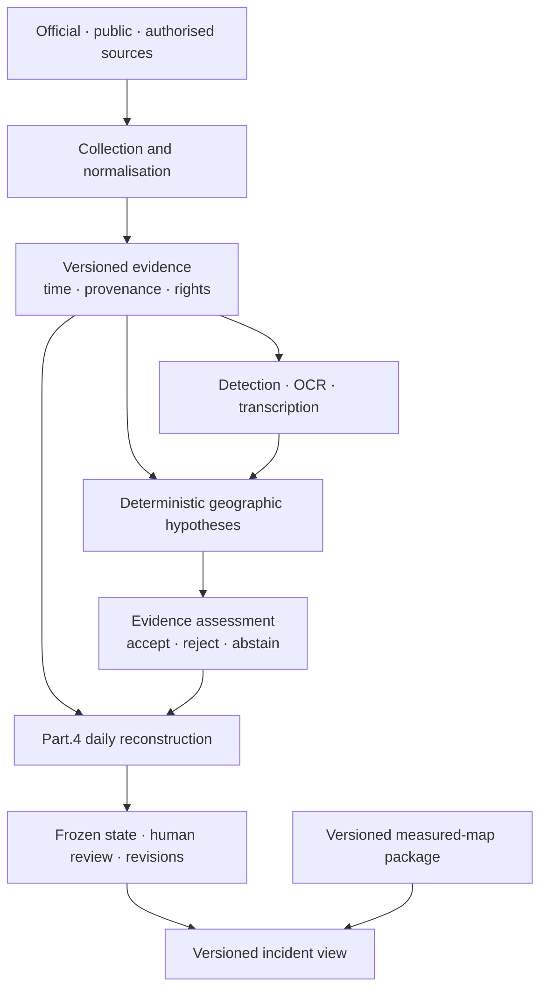

# FireViewer

Voir [ORGANISATION.md](ORGANISATION.md) pour les responsabilités, le dépôt de commit et la reprise du travail.

**Evidence-centred infrastructure for documenting, reviewing, mapping and studying wildfire events.**

FireViewer is a maintainer-led research and engineering project. Its application
and domain components are maintained in dedicated `fireviewer` repositories.
The French non-profit association **FIRE-VIEWER** provides administrative and
financial stewardship for association-controlled resources.

Technical development is currently led by **Unicorn Who Dev**. The generic
Map Builder remains a separate UWD component. Historical authorship,
pre-association rights and explicit asset agreements are preserved; repository
placement does not by itself establish legal ownership.

The project combines official and public sources, authorised contributions,
deterministic geographic processing, machine-assisted analysis and human
review. Provenance, uncertainty and revision history remain visible throughout
the pipeline.

> FireViewer is not an emergency alert service, an official wildfire source,
> an incident-command system or a certified fire-propagation predictor. In an
> emergency, follow the competent authorities and emergency services.

## Documentation actualisée le 19 septembre 2026

- [Présentation en une page](docs/public/presentations/PRESENTATION_1_PAGE.md), [pitchs](docs/public/presentations/PITCHS.md) et [partenaires/financeurs](docs/public/presentations/PRESENTATION_PARTENAIRES_FINANCEURS.md).
- [Présentation technique](docs/public/presentations/PRESENTATION_TECHNIQUE.md) et [gouvernance/droits](docs/public/presentations/GOUVERNANCE_ET_DROITS.md).
- [18 fiches GitHub](docs/public/repositories/README.md) : 16 dépôts cœur/institutionnels/infrastructure/transitoires et 2 auxiliaires Android.
- [Catalogue public HF](docs/public/HUGGINGFACE.md) : 5 modèles et 4 datasets, avec statuts et limites.
- [Vocabulaire des statuts](docs/public/STATUTS_ET_VOCABULAIRE.md) et [maintenance documentaire](docs/public/maintenance/PLAN_DE_MAINTENANCE.md).

Site institutionnel : [fire-viewer.fr](https://fire-viewer.fr). La date de revue documentaire ne renouvelle aucune preuve de fonctionnement.

## Public source components

The [first public source release](docs/public/OPEN_SOURCE.md) opens eight components on 19 September 2026. Sites, backend, Android applications and infrastructure remain private. Source publication retains existing licences and does not establish production readiness.

## Core rule

```text
observed ≠ reconstructed ≠ simulated ≠ predicted
```

A detector result is not a coordinate. A model result is not publication
authority. A reconstructed state is not silently relabelled as an observation.
When the available evidence is insufficient, `unknown` or `abstain` is the
correct result.

## System overview



The generic Map Builder is a separate UWD component. FireViewer consumes
versioned geography packages while retaining incident identity, access control,
human decisions and publication authority.

## Current maturity

FireViewer is an active research MVP. The repositories contain substantial
implementation for evidence handling, vision, geolocation, supervision,
orchestration, daily fire-state calculation, map integration and public
visualisation.

This does not establish unattended production readiness, field accuracy or
scientific qualification. Sensitive machine-assisted results remain subject to
human validation. FireViewer does not predict future wildfire propagation.

See:

- [Architecture](docs/public/ARCHITECTURE.md)
- [Evidence and review](docs/public/EVIDENCE_AND_REVIEW.md)
- [Daily reconstruction](docs/public/RECONSTRUCTION.md)
- [Current status](docs/public/STATUS.md)
- [Repository guide](docs/public/REPOSITORIES.md)
- [Repository hygiene](docs/public/REPOSITORY_HYGIENE.md)
- [Data governance](docs/public/DATA_GOVERNANCE.md)
- [Map Builder boundary](docs/public/MAP_BUILDER.md)
- [Web atlas](docs/public/WEB_MAPS.md)

## Models, datasets and measured maps

Hosted research artifacts are published through the FireViewer Hugging Face
organisation:

**https://huggingface.co/fireviewer**

Each model, dataset and spatial artifact retains its own licence, source rights,
revision and maturity status. Public availability does not by itself mean that
an artifact is active in production or scientifically qualified.

## Governance and ownership

The association FIRE-VIEWER provides administrative and financial stewardship
for association-controlled resources. Technical development is currently led
by one maintainer.

Pre-association assets, UWD components and association assets remain separated
through explicit inventories, licences and assignment decisions. Repository
placement records technical stewardship but does not by itself transfer
intellectual-property rights.

See [Governance](GOVERNANCE.md) and [Licensing](docs/LICENSING.md).

## Contributing and security

- [Contributing](https://github.com/fireviewer/.github/blob/main/CONTRIBUTING.md)
- [Code of Conduct](https://github.com/fireviewer/.github/blob/main/CODE_OF_CONDUCT.md)
- [Security](https://github.com/fireviewer/.github/blob/main/SECURITY.md)
- [Support](https://github.com/fireviewer/.github/blob/main/SUPPORT.md)

For research, infrastructure, collaboration, rights, provenance or private
security reports:

**contact@fire-viewer.fr**
