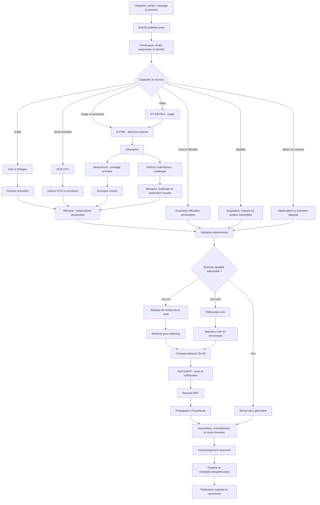

# Architecture canonique FireViewer

**Statut documentaire :** source de vérité inter-dépôts

**Statut du recadrage événementiel :** socle backend, worker, formulaire, revue, registre externe, rétention et projection publique v2 3D/2D `IMPLEMENTED_TESTED_LOCAL` derrière flags ; dépendances et migrations live non vérifiées ; enveloppes, progression, recette déployée et replay complet `PENDING`

**Portée :** frontend, backend, worker IA, spatial, génération de données et publication

FireViewer est une plateforme incidente-centrique de documentation, d’analyse supervisée et de représentation spatiale des incendies. Son architecture cible organise les contributions, preuves, sources externes et propositions autour d’événements documentés et versionnés. Elle ne constitue ni un service d’alerte, ni une source officielle, ni un outil de conduite des secours.

## Dépôts actifs

| Dépôt | Responsabilité |
| --- | --- |
| `fireviewer-frontend` | Interface publique, administration, revue humaine et visualisation. |
| `fireviewer-backend` | Registre incident-centrique, preuves, orchestration, audit et publication. |
| `fireviewer-ai-worker` | Analyse privée des médias, modèles, stages, abstentions et propositions. |
| `fireviewer-spatial` | Référentiels, packages, rendus, contrats de caméra et géométrie. |
| `fireviewer-sdg` | Données synthétiques, annotations, provenance et validation réel/synthétique. |
| `fireviewer_doc` | Architecture, roadmap, statuts, sécurité, terminologie et contrats communs. |

L’ancien dépôt `charli-dev420/fireviewer` reste une archive technique et documentaire. Il ne porte plus la roadmap active.

## Principes d’architecture

### Une identité stable par incident

La route publique canonique est :

```text
/incident/{fire_id}
```

Les épisodes, observations, preuves, propositions, révisions spatiales et publications sont rattachés à cette identité sans fusion silencieuse.

### Un événement documenté comme objet métier cible

Le flux cible commence par un `EventCandidate`, pas par une image isolée. L’utilisateur fournit :

- le point de prise de vue sur la carte ;
- le moment ou l’intervalle de l’observation ;
- un message et/ou des preuves facultatives ;
- les autorisations applicables.

Le point de prise de vue représente l’observateur ou la caméra. Il reste distinct de la géométrie de flamme, de fumée ou de front produite par l’analyse.

L’admission met directement une analyse privée en file. La publication reste une décision séparée.

### Séparation des responsabilités

Le système distingue :

1. l’événement candidat et son point de vue ;
2. le message, le média ou la source originale ;
3. les artefacts dérivés et leur filiation ;
4. les sorties de perception ;
5. les assertions et observations structurées ;
6. les tentatives de localisation et abstentions ;
7. les révisions d’événements et enveloppes ;
8. les décisions de revue ;
9. les publications.

Une sortie de modèle ne modifie jamais directement un objet public.

### Graphe déclaratif, GPU séquentiel

Le plan de contrôle évolue vers un graphe déclaratif de stages. Chaque stage possède :

- des capacités requises ;
- une pré-gate et une post-gate ;
- des entrées et sorties typées ;
- un statut explicite ;
- des règles de reprise ;
- un profil de cascade, consensus ou shadow mode.

Le graphe ne provoque pas l’exécution parallèle des gros modèles. Le worker conserve un seul modèle lourd chargé à la fois, avec déchargement entre les stages.

### Revue humaine

Les décisions restent séparées :

- fait ;
- repère visuel ;
- géométrie ;
- rapport ;
- média ;
- publication.

Aucun seuil automatique ne déclenche seul une publication.

## Architecture logique



Ce graphe reste l’architecture cible complète. Le chemin local testé couvre les événements privés, leur revue, les snapshots, la timeline publique et la projection des événements publiés en texte, 3D et 2D. Les modèles lourds, connecteurs live, enveloppes, progression, LOD avancé et recette déployée ne sont actifs qu’après leurs gates respectives dans `STATUS_MATRIX.md`.

## Pipeline média

### Composants FireViewer à conserver

- D-FINE XLarge : détection principale sur images et keyframes ;
- RT-DETRv2-R50 : second détecteur et triage vidéo ;
- MolmoPoint-8B FireViewer : pointage primaire actuel ;
- Prithvi officiel : branche auxiliaire de surface brûlée lorsque le produit est compatible.

Un composant intégré n’est pas automatiquement considéré comme validé. Son statut est suivi dans `STATUS_MATRIX.md`.

### Migration Qwen vers Ministral

Ministral 3 8B Instruct est la cible retenue pour :

- l’extraction structurée ;
- la recherche via un courtier borné ;
- la préparation de rapports privés ;
- l’arbitrage limité aux sorties textuelles ou structurées.

Ministral ne produit pas de coordonnées, ne valide pas une pose, ne confirme pas automatiquement un incendie et ne publie aucune information.

### Profils de détection

- `production_cascade` : RT-DETRv2 trie la vidéo, D-FINE traite les keyframes retenues ;
- `validation_quorum` : les détecteurs sont comparés sur les lots de validation ;
- `shadow_sampling` : le second détecteur est exécuté sur un échantillon ou un cas incertain.

RF-DETR reste un challenger de benchmark.

### Pointage et segmentation

MolmoPoint reste primaire tant que DINOv3 n’est pas entraîné et qualifié.

Le challenger DINOv3 doit produire :

- des masques par instance ;
- des heatmaps d’ancrage ;
- une abstention visuelle ;
- une estimation d’incertitude ;
- une cohérence masque-point vérifiée.

Les statuts visuels et géométriques sont distincts.

**Perception :**

- `insufficient_visual_anchor`
- `ambiguous_anchor`
- `no_visible_ground_origin`

**Géométrie :**

- `insufficient_geometry`
- `unstable_camera_pose`
- `invalid_raycast`
- `uncertainty_above_limit`

SAM sert à l’annotation, à la correction et à la propagation vidéo, pas à la décision finale du runtime.

### OCR

L’OCR fournit des indices à corroborer. Une inscription visible ne confirme jamais seule une localisation, une date ou une source.

L’absence d’EXIF n’annule pas le média. Elle limite uniquement la branche spatiale.

## Registre de preuves

Chaque artefact conserve :

- identifiant ;
- lot et média parent ;
- liens de filiation ;
- URI privée ;
- empreinte ;
- format ;
- modèle et révision ;
- profil d’inférence ;
- version du contrat ;
- statut de validation ;
- trace d’audit.

Toute observation structurée référence des `evidence_refs` existants.

Une preuve peut soutenir plusieurs événements. Un événement peut être soutenu par plusieurs preuves. La proximité ne constitue ni une identité d’événement, ni une indépendance de source.

## Sources externes

Les connecteurs cibles couvrent notamment :

- communications des préfectures, SDIS/SIS, Sécurité civile, mairies et organismes publics ;
- Sentinel-1/2 et autres acquisitions d’observation terrestre ;
- FIRMS et EFFIS pour les détections thermiques ;
- Copernicus EMS pour les produits de délinéation et de dommage ;
- Météo-France pour observations et prévisions séparées ;
- IGN pour les référentiels ;
- BDIFF pour le bilan rétrospectif.

Chaque artefact externe conserve collection, révision, temps, CRS natif, footprint, licence, attribution, filiation et statut provisoire ou corrigé. Deux produits dérivés du même passage capteur ne sont pas deux corroborations indépendantes.

Le contrat complet est défini dans [`EXTERNAL_SOURCE_CONNECTORS.md`](EXTERNAL_SOURCE_CONNECTORS.md).

## Branche spatiale

### Photos au sol

```text
package de la zone
→ banque de rendus locale
→ retrieval DINOv3
→ filtres EXIF / horizon / FOV / relief
→ RoMa v2
→ points 2D-3D
→ PyCOLMAP
→ raycast MNT
→ propagation d’incertitude
```

La banque est limitée à la zone de l’incident. Elle ne nécessite pas d’index national pour le pilote.

MoGe peut fournir des signaux auxiliaires. Il ne remplace ni les points 2D-3D, ni la pose, ni le raycast.

### Vues UAV

AerialExtreMatch-RoMa, RoMa v2, AdHoP/OrthoLoC et les autres challengers sont comparés sur les mêmes lots avant toute promotion.

### Géométrie déterministe

PyCOLMAP est la cible pour l’estimation robuste, le raffinement et la covariance locale de pose.

L’enveloppe d’incertitude finale intègre aussi :

- le pointage ;
- les intrinsics ;
- les correspondances ;
- le modèle de caméra ;
- le terrain.

Elle n’est appelée « ellipse de confiance » qu’après calibration empirique. Avant cela, le terme `uncertainty_envelope` est utilisé.

## Satellite et simulation

Les objets suivants restent distincts :

- `observed_hotspot`
- `observed_burned_perimeter`
- `human_reviewed_active_zone`
- `simulated_scenario`

Un hotspot ne confirme pas automatiquement un feu. Une surface brûlée n’est pas une zone active. Une simulation reste hors du pipeline public courant sans décision produit dédiée.

Les couches temporelles cibles restent distinctes : `event`, `front`, `activity_envelope`, `burned_area` et `simulation`. Une enveloppe probable référence les événements qui la soutiennent et ne remplit pas silencieusement les périodes ou zones non observées.

## Promotion

Ordre de promotion :

```text
benchmark hors ligne
→ replay local
→ recette GPU
→ shadow mode
→ propositions privées
→ validation indépendante
→ publication humaine limitée
```

Toute promotion exige des révisions verrouillées, des contrats versionnés, des artefacts de benchmark, une analyse d’erreurs, un rollback et une décision humaine explicite.

Aucune valeur de précision, de latence, de mémoire ou de coût n’est publiée sans artefact de mesure reproductible.
