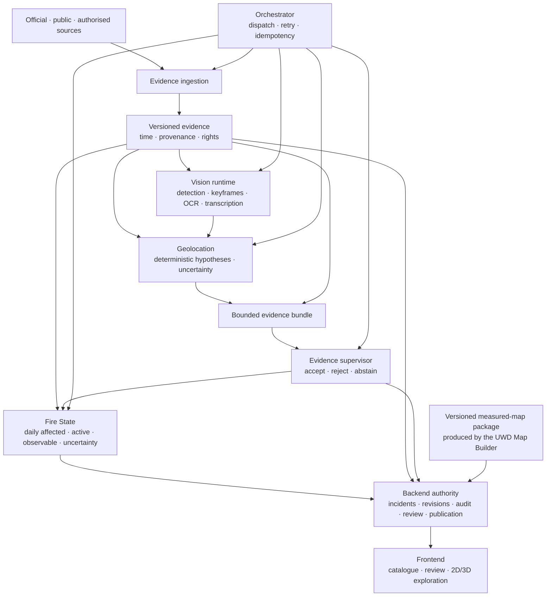

# FireViewer public architecture

## Design objective

FireViewer turns heterogeneous wildfire observations into reviewable evidence
and versioned geographic representations. It is incident-centred: a photo,
article, satellite item or model output never becomes a published fact by
itself.

The architecture keeps the following classes distinct:

```text
source fact
observation
derived machine result
geographic hypothesis
FireViewer calculation
human decision
published representation
```

FireViewer does not predict future wildfire propagation.

## Component flow



The orchestrator coordinates execution but does not become a second source of
business truth. Durable incident identity, permissions, revisions, human
decisions and publication remain in the backend.

## Repository responsibilities

| Component | Responsibility |
| --- | --- |
| `fireviewer-contracts` | Shared evidence, geometry and result contracts. |
| `fireviewer-evidence-ingestion` | Bounded source, media, transcription and satellite acquisition/normalisation. |
| `fireviewer-vision-runtime` | Image/video observations such as boxes, masks, keyframes and text extraction. |
| `fireviewer-geolocation` | Deterministic geographic candidates with explicit uncertainty and missing inputs. |
| `fireviewer-evidence-supervisor` | Structured support, contradiction and `accept`, `reject` or `abstain` assessments. |
| `fireviewer-orchestrator` | Execution order, retries, receipts and idempotency. |
| `fireviewer-fire-state` | Deterministic Part.4 state calculation and evaluation logic. |
| `fireviewer-model-lab` | Corpus preparation, training recipes, benchmarks and the model registry. |
| `fireviewer-backend` | Durable incident authority, permissions, review, audit and publication. |
| `fireviewer-frontend` | Contribution, review and public incident exploration. |
| `fireviewer-unreal` | Fire-specific visualisation and scenario integration. |
| `fireviewer-docker` | Version-locked FireViewer composition and deployment profiles. |
| `unicornwhodev/map-builder` | Generic measured-map production supplied as a separate UWD component. |

## Evidence acquisition

The acquisition layer records source identity, retrieval time, publication or
availability time when known, rights, hashes and processing outcomes. Raw public
pages and media are not retained merely because they can be downloaded.

Historical reconstruction distinguishes:

- observation or acquisition time;
- provider publication or availability time;
- FireViewer retrieval time;
- the state cutoff being reconstructed.

A product found today is not silently treated as evidence that existed at an
earlier cutoff.

## Vision and geolocation

Vision models produce image-space observations. They do not create geographic
truth. Geolocation is a separate stage that can combine camera position and
accuracy, orientation, field of view, relief, roads, buildings, vegetation,
map references, orthophotography, Panoramax and previous reviewed states.

A result must retain its uncertainty and the inputs used. Missing essential
camera or terrain information can lead to a larger candidate region, low
confidence or abstention.

## Supervision and human validation

The evidence supervisor evaluates a supplied candidate and returns structured
support, contradictions, missing evidence and a verdict. It may not silently
replace the original candidate geometry.

Sensitive machine-assisted results remain subject to human review. Publication
is a backend decision, not a model tool call.

## Part.4 fire-state calculation

Fire State produces dated `affected`, `active`, `observable` and uncertainty
representations from admissible evidence and a documented initialization. A
thermal footprint, camera intersection or model output contributes bounded
support; none becomes an exact perimeter automatically.

Checkpoints and revisions preserve parent identity, inputs, profile version and
lineage. Corrections append a new revision rather than rewriting the previous
state.

## Measured maps

Measured-map production is separate from incident reconstruction. The UWD Map
Builder receives an immutable geographic request and produces a versioned
package with terrain, viewer derivatives, manifests, provenance and validation
receipts.

FireViewer attaches an accepted package to an incident and retains access
control and publication authority. Wildfire evidence does not become a Map
Builder input, and a map package does not assert wildfire activity.

## Storage and trust boundaries

- External content is untrusted until bounded, attributed and hashed.
- Private evidence remains access-controlled.
- Model outputs are derived results, never source evidence.
- Simulation and synthetic data remain separate from real-event evidence.
- Git repositories contain source and reviewed fixtures, not credentials,
  private evidence, weights or produced map packages.
- Secrets and provider configuration remain outside source control.

## What this architecture does not claim

It does not claim real-time alerting, official incident status, emergency
command capability, autonomous publication, certified geographic accuracy or
future fire-spread prediction. Source code existing is not proof that a complete
real-data path is operational or scientifically qualified.
