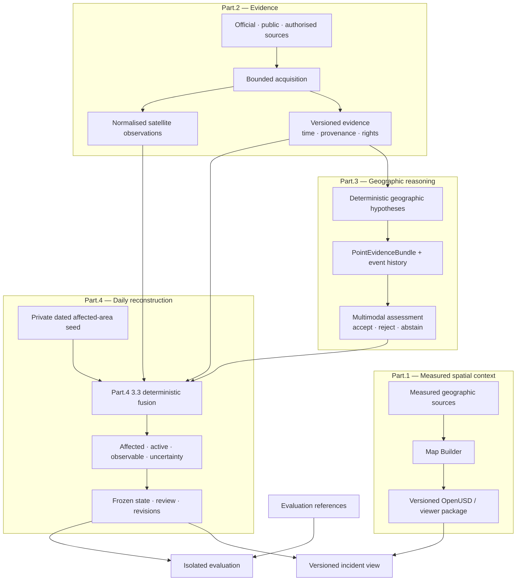

# FireViewer public architecture

## Design objective

FireViewer turns heterogeneous wildfire observations into reviewable evidence and versioned geographic representations. The system is incident-centred: a photo, article, satellite item or model output is never treated as an isolated fact and never becomes publication authority by itself.

## End-to-end flow

The graph shows component boundaries, not proof that every path is enabled or accepted end to end. Evaluation references never enter reconstruction.

Providers are interchangeable behind explicit contracts. Missing optional evidence must reduce confidence or produce abstention rather than be silently replaced by invented data.

## Acquisition and normalisation

The acquisition layer discovers official information, public reporting and eligible media. It records source identity, retrieval time, publisher, URL, hashes and processing outcomes. Complete scraped articles, copied public-media binaries and full transcripts are not intended to become a durable shadow archive.

Video is reduced to immutable selected keyframes before visual analysis. Visual detectors provide boxes, classes and scores only.

Official satellite acquisition is structured rather than treated as arbitrary web evidence. Current CPU paths include CLMS burn-scar products, Sentinel-3 FRP observations, NASA FIRMS MODIS/VIIRS footprints, Sentinel-2 materialisation/change and bounded Sentinel-1 radar change. Raw transient products and retained derivatives follow separate storage and rights rules.

### Historical admissibility

Retrospective reconstruction distinguishes **acquisition time**, **provider publication or availability time**, **FireViewer retrieval time** and the **state cutoff** being reconstructed.

A product discovered during a later replay is admissible only when its recorded availability is compatible with that historical cutoff.

Unknown or late availability does not become historical evidence by inference.

Likewise, missing coverage, cloud, no-data and absence of a valid positive detection are different states and must not automatically become evidence that fire was absent.

This boundary matters particularly for satellite and archive-corpus workflows, where the present-day catalog can contain products or revisions that did not yet exist at the historical date being evaluated.

## Deterministic geography

Geographic hypotheses are built separately from object detection. Inputs can include:

- upload position and declared horizontal accuracy;
- capture time, heading, pitch, roll and field of view;
- image-space observations and their uncertainty;
- terrain elevation and line-of-sight calculations;
- map, geocoding, satellite and official geographic references;
- earlier reviewed fire states and perimeters.

If essential camera information is missing, the correct result can be a larger search region, low-confidence candidate or `abstain`.

## Event memory and evidence assembly

Evidence is stored by event, time, geographic distance, type, revision and source. Spatial and temporal filtering happens before semantic retrieval. Summaries keep references to immutable evidence rather than silently replacing earlier event states.

The final multimodal provider receives a bounded candidate dossier rather than an uncontrolled dump of all event media.

## Multimodal assessment

The supervisor evaluates a supplied geographic candidate against its evidence bundle. It returns structured support, contradictions, missing evidence and an `accept`, `reject` or `abstain` verdict.

Its score is not publication confidence. Calibration and deterministic backend policy remain separate.

A correction cannot silently mutate the original candidate. It is represented as a competing referenced object with its own provenance and review trail.

## Part.4 3.3 fire-state reconstruction

The current deterministic reconstruction line is **Part.4 3.3**, algorithm version `3.3.0`.

It normalises georeferenced observations onto an adaptive EPSG:2154 probability grid and produces EPSG:4326 `affected`, `active` and uncertainty geometry. Thermal footprints, camera intersections and other point evidence contribute bounded probabilistic support; none is promoted directly into an exact boundary.

Observations from one product lineage contribute without masquerading as independent sources. Multiple probability buckets from the same product can preserve spatial variation while remaining one lineage and one independent source family.

The current baseline profile is `part4-framed-v1` (version `1.0.0`). Its identity and SHA-256 are embedded in reconstruction artifacts and receipts.

Initialization is a private dated affected contour, not an implicit active area. Checkpoints preserve probability grids and per-lineage contributions. Disputed extensions remain separate; accepted operator corrections append revisions and mark descendants stale without silently replaying history. Satellite availability, acquisition time and state cutoff remain distinct.

The seeded historical protocol excludes its initialization contour from scoring and compares later frozen states with an unchanged-seed baseline. Calibration and holdout data remain isolated. See [Daily reconstruction](RECONSTRUCTION.md) for the complete state, satellite and evaluation boundary.

### Probability and provenance rasters

Part.4 3.3 can retain aligned Cloud-Optimized GeoTIFF products:

- probability bands for `affected`, `active` and `observable`;
- provenance bands for direct observation support, multi-source support, prior/interpolated support and uncertainty support.

The products share an aligned grid, input identity, algorithm revision, fusion-profile identity and immutable receipts.

### Calibration boundary

Calibration is an offline CPU workflow separated from incident publication. It can use immutable private Hugging Face dataset revisions, incident-grouped splits, frozen predictions, threshold/profile screening, confidence calibration and isolated holdout evaluation.

The prediction must be frozen before a held-out reference is opened. Calibration and holdout resources remain separate and the calibrator must not inspect holdout material during fitting.

**No France profile is currently qualified.** The baseline remains uncalibrated and cannot authorise unattended publication.

## Backend and publication

The backend owns durable incident records, immutable evidence revisions, assessment receipts, audit events, review state and publication gates. A deployed worker is not automatically enabled and model output cannot publish directly.

A future qualified profile can authorise only the components explicitly allowed by the qualification contract. Active geometry remains separately guarded.

## Measured maps and spatial products

Map creation remains a separate deterministic subsystem from Part.4 fire-state reconstruction.

The provider-neutral Map Builder receives an immutable request, uses a caller-provided scratch directory and emits a versioned package. Large requests can be split into disjoint resumable tile shards followed by one final assembler.

The browser package is tiled and can combine a lightweight far view, shared prototype namespaces, terrain tiles, placement payloads and a catalogue for progressive loading. Viewer derivatives do not replace authoritative geographic artifacts.

`fireviewer-spatial` owns the portable export contracts. The source-only
local, unpublished `fireviewer-unreal` working tree consumes those contracts
for Unreal Engine assembly and local visual review. Its publication is paused.
A guarded backend `aws_unreal` adapter can address a
separately configured self-terminating Windows worker; it is disabled by
default and keeps cloud identifiers out of source control.

The local Unreal working tree includes one invented JSON/GeoJSON incident
fixture for contract testing. It contains no real incident evidence, imported
content library, dataset, model, generated map or reproduction output. Presence
of these source paths does not establish packaged-build, cloud-runtime, visual
or production acceptance.

Real measured packages are hosted in `fireviewer/simple-measured-scenes-v1`. Their published paths are compatibility-sensitive because the viewer can consume them directly. Documentation cleanup must not reorganise those paths.

The repository-side `reference/map-builder-reference-v1` directory is a semantic validation/migration baseline, **not a production map**. It remains separate from hosted measured-map products.

## Synthetic data

Synthetic scenarios, rendered observations and Omniverse reproduction material are maintained separately from real-event evidence and measured-map production.

A synthetic result can support development or evaluation but cannot become evidence of a real wildfire state.

## Trust boundaries

- External sources are untrusted until bounded, attributed and hashed.
- Uploaded media require explicit authorisation and independent handling controls.
- Model outputs are derived evidence, never source evidence.
- Geographic hypotheses are separate from visual detections.
- Simulation and synthetic data remain labelled and separate from real events.
- Publication is a backend policy decision, not a model tool call.
- Sensitive services follow least privilege and may remain disabled even when code exists.
- Git repositories contain source and bounded synthetic fixtures, not datasets,
  weights, private incident material, asset libraries or reproduction outputs.

## What this architecture does not claim

It does not claim real-time alerting, official incident status, operational readiness, certified geographic accuracy, autonomous publication or validated future fire-spread prediction.
