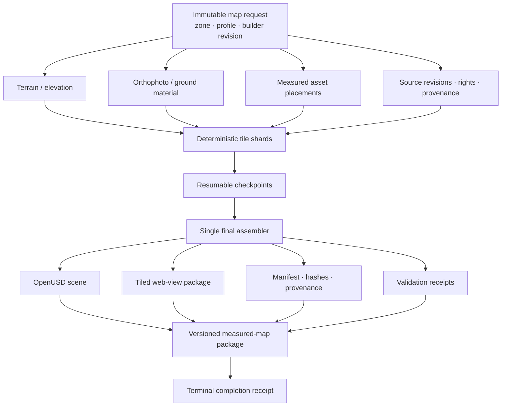

# FireViewer Map Builder

The FireViewer Map Builder turns one immutable geographic request into a versioned measured-map package. Its core engine is provider-neutral: it receives a request, a scratch directory and an output directory. Cloud launch, object storage, credentials and publication remain adapters outside the builder.

## Production contract

One request fixes the zone identity, centre, side length, profile, builder revision and output identity.

The engine writes temporary work below the provided scratch root and emits authoritative geographic artifacts, runtime viewer artifacts, manifests, provenance, metrics and a terminal completion receipt.

The completion receipt is written last. Artifacts without that receipt form an incomplete build and must not be presented as a valid measured-map production.

The diagram shows the package-production boundary. Wildfire observations, Part.4 state reconstruction and simulation are not Map Builder inputs and do not rewrite the measured map.

## Tiled viewer

The production viewer is a tiled package rather than one mandatory monolithic GLB. A package can contain:

- a lightweight far view for continuous geographic context;
- shared prototype namespaces for reusable assets;
- per-tile terrain payloads;
- per-tile placement payloads;
- a catalogue for progressive loading.

The browser can load and evict detailed tiles according to camera visibility and a bounded resident-tile budget. Viewer optimisation must not rewrite authoritative geographic results.

## Resumable workers

Large requests can be partitioned into disjoint deterministic tile shards. Each shard owns a fixed tile set and can publish resumable checkpoints. A single dependent assembler restores the complete checkpoint set and creates the final package.

Source metatiles remain assigned deterministically so shared downloads are not duplicated unnecessarily across workers.

The same engine can support an asset-free profile. An asset-free build keeps an explicitly empty prototype namespace, including across resume, instead of inventing placeholder assets.

## Validation boundary

Validation can check:

- request identity;
- tile coverage;
- geographic bounds;
- package structure;
- provenance and licences;
- required receipts;
- semantic parity across supported execution environments.

Binary identity is not required for formats that can contain variable metadata; semantic equivalence is the relevant comparison where documented.

A successful synthetic test, container run or cloud replay does not prove every map size, source condition, browser or publication route. Runtime resource measurements, visual review, public loading and atomic publication remain separate acceptance gates.

## Measured-map publication

Real measured packages are hosted in:

[`fireviewer/simple-measured-scenes-v1`](https://huggingface.co/datasets/fireviewer/simple-measured-scenes-v1)

That repository is a compatibility surface for the viewer. Existing published directories, filenames and package paths can be referenced directly by consumers.

**Documentation cleanup must not rename, move, flatten or reorganise existing measured-map packages.** A structural migration requires an explicit versioned migration contract and coordinated update of every consumer.

New real map builds should be added with their own zone identity, build identity, provenance, integrity hashes and validation state rather than replacing a referenced build silently.

## What is not a measured map

The following artifact families are deliberately separate from measured-map production:

- synthetic Omniverse scenes;
- historical reproduction packs;
- unit/integration fixtures;
- cloud-provider migration baselines;
- temporary build outputs;
- unaccepted validation runs.

The repository directory `fireviewer-spatial/reference/map-builder-reference-v1` is a **semantic validation baseline for the AWS migration**, not a published production map. It is intentionally left in place; documentation classifies it correctly without moving it and risking broken references.

## Data and security

Source rasters, generated production packages, checkpoints, private evidence, credentials, provider identifiers and operator runbooks do not belong in Git.

Public source repositories contain code, portable contracts, small validation fixtures and concise documentation. Heavy measured-map artifacts remain in designated artifact storage.

## Relationship to Part.4

Map creation is separate from **Part.4 3.3** fire-state reconstruction. The map defines measured geographic context; Part.4 reconstructs dated wildfire state from reviewed observations. Neither should be presented as the other.
