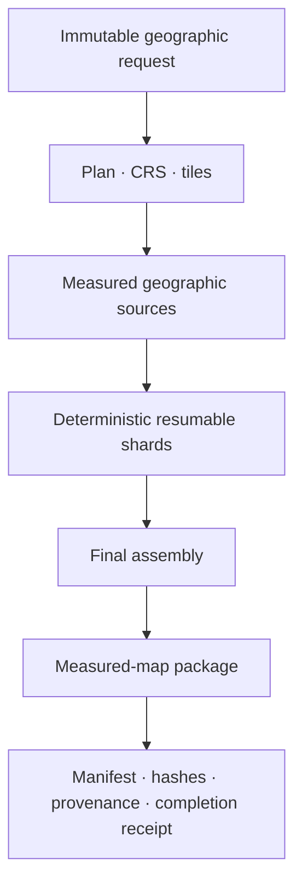

# Map Builder boundary

## Role

The generic Map Builder is maintained by **Unicorn Who Dev** in the private
repository `unicornwhodev/map-builder`.

It turns one immutable geographic request into a versioned measured-map package.
The builder does not own FireViewer incidents, user accounts, evidence,
machine-assessment decisions or publication state.

FireViewer consumes the builder through versioned packages and, where enabled,
a pinned CLI, API or container image. The FireViewer backend remains the
authority for incident attachment, permissions, review and publication.

## Responsibility split

| UWD Map Builder | FIRE-VIEWER |
| --- | --- |
| Geographic request validation and planning | Existing incident identity and authorisation |
| Geographic-source acquisition adapters | Selection of the incident and requested area |
| Terrain and map-package production | Dispatch policy and use of the returned package |
| CLI, API and producer interface | FireViewer-specific backend and frontend adapters |
| Generic cartographic validation receipts | Incident audit, review and publication records |
| Generic cartographic Unreal integration | Fire-specific Unreal visualisation and scenarios |

Repository placement records technical stewardship. Ownership and usage rights
remain governed by the applicable licences and written UWD/FIRE-VIEWER
agreements.

## Production contract

One request fixes, at minimum:

- request and zone identity;
- geographic centre and requested extent;
- coordinate reference system and profile;
- builder and contract revisions;
- input-source identities;
- scratch and output locations supplied by the caller;
- expected output identity.

The builder writes temporary work only below the supplied scratch root and emits
its final package below the supplied output root. A terminal completion receipt
is written last. Outputs without that receipt are incomplete and must not be
presented as an accepted measured-map build.

## Package classes

A package can contain:

- authoritative terrain and geographic artifacts;
- a portable OpenUSD scene;
- a tiled browser-view package;
- shared prototype and placement payloads;
- source, rights and provenance manifests;
- validation metrics and terminal receipts.

Viewer derivatives improve loading and presentation but do not replace the
authoritative geographic artifacts.

## Resumability

Large requests can be partitioned into deterministic tile shards. Each shard
owns a fixed tile set and publishes checkpoints. One dependent assembler restores
the complete checkpoint set and creates the final package.

A resumed job must preserve request identity, tile ownership, source revisions
and output identity. Resume is not permission to mix outputs from different
profiles or source versions.

## FireViewer integration

FireViewer sends only the technical request needed for map production. The
builder does not receive authority to publish an incident or approve evidence.

The integration is version-locked through one or more of:

- a package version;
- an immutable source revision;
- a container digest;
- a request/response schema revision.

`fireviewer-docker` composes the FireViewer services and references the approved
UWD image or package. It does not copy the Map Builder source into the
association repository.

## Unreal separation

The UWD repository owns generic cartographic Unreal tooling. The private
`fireviewer-unreal` repository owns FireViewer-specific fire visualisation and
scenario logic. A FireViewer adapter may consume the UWD plugin or package, but
must not maintain a silent second implementation of the generic builder.

Source presence does not establish packaged-build, visual, cloud-runtime or
production acceptance.

## Measured-map publication

Accepted real measured packages are hosted in the designated FireViewer
artifact repository, currently:

`fireviewer/simple-measured-scenes-v1`

Published paths are compatibility-sensitive. Existing directories, filenames
or identifiers must not be moved merely to make a repository look tidier. A
structural change requires a versioned migration and coordinated consumer
updates.

A measured map describes geographic context. Dated wildfire perimeters,
activity, located-photo references and Part.4 results remain separate incident
layers.

## Security and data boundary

The public source repositories must not contain:

- provider credentials or signed URLs;
- local machine paths or operator configuration;
- source rasters or private evidence;
- generated production packages or checkpoints;
- internal deployment identifiers;
- licensed asset libraries without redistribution rights.

## Non-goals

The Map Builder is not an emergency system, an incident registry, an evidence
supervisor or a wildfire-propagation predictor.
