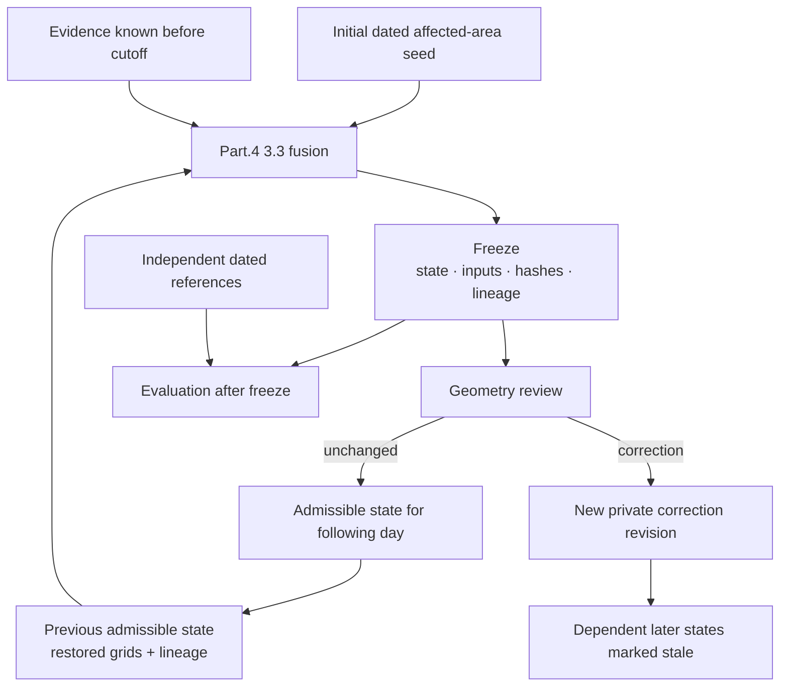
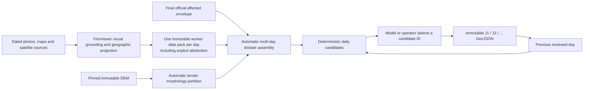

# Daily wildfire reconstruction

Part.4 is the backend's deterministic reconstruction layer. It combines dated, georeferenced evidence into a reviewable daily state. It does not discover an incident by itself, run the Map Builder, or issue a fire-spread forecast.

## State and responsibilities

The graph describes implemented responsibilities, not an enabled or qualified production service. Evaluation references have no path into fusion.

An administrative seed contains a position and an estimated **affected** contour with its validity time and accuracy. It does not imply that the entire contour is active. Without a valid seed, reconstruction waits explicitly; public perimeters are not silently reused as initialization.

The current line is **3.3.0**, with profile `part4-framed-v1` version `1.0.0`. The profile is allowlisted, identified by SHA-256 and **uncalibrated**. Its output cannot authorize unattended publication.

## Separate reviewed hindsight protocol

Completed incidents can use a second, explicitly hindsight-constrained protocol.
It does not replace the causal Part.4 path and its products cannot be scored as
information that was available during the event.

The final perimeter is recorded as a constraint, not concealed as ordinary input.
Smoke is never converted directly into affected area. FireViewer's existing worker
grounds visual observations, projects them against camera and terrain references and
can abstain when geometry is insufficient. A pinned DEM is partitioned automatically
into connected elevation/aspect morphology units. The reviewer neither prepares these
inputs nor edits a polygon; it selects one supplied candidate with evidence references
and rationale. Evidence discovered after a day's state time remains labelled as
hindsight evidence.

Every accepted day is cumulative, retains the exact previous reviewed geometry and
must remain inside the final envelope. The offline output declares
`hindsight_constrained: true`, `comparable_to_causal_reconstruction: false` and
`eligible_for_automatic_publication: false`.

The date range can contain up to 366 days. Days without new admissible evidence remain
in the chain as explicit no-change candidates, so `J1`, `J2`, and later files describe
the complete reviewed sequence rather than a two-day special case.

Assembly requires one declared, hashed worker pack for every calendar date in that
range. A worker may abstain and return a valid pack with zero projected geometry; this
still proves that the day was processed. Omitting a day, reusing a batch across two
days, or placing a dated observation in the wrong daily pack is rejected. The backend
test dataset stores three independent JSON packs under
`tests/fixtures/retrospective_daily_packs/`, including an abstention pack for day 2.
Those files are synthetic test inputs and are not evidence for a real incident.

## Four distinct outputs

| Product | Meaning |
| --- | --- |
| `affected` | Cumulative affected-area reconstruction with retained history. |
| `active` | Bounded evidence of activity; not every affected location is active. |
| `observable` | Evidence coverage, distinct from presence or absence of fire. |
| Uncertainty | Spatial uncertainty and support limitations, retained for review. |

Fusion uses an adaptive Lambert-93 probability grid and exports WGS84 geometries. Probability and aligned provenance COGs preserve the grid, input identity, algorithm and profile. Checkpoints retain probability arrays and per-lineage contributions instead of rebuilding uniform probabilities from old polygons. Multiple buckets from one product remain one lineage, not independent sensor votes.

## Evidence and satellite semantics

| Source family | Admissible meaning |
| --- | --- |
| Sentinel-2 pre/post optical change | Affected-area support with explicit valid coverage; not an active-front observation. |
| FIRMS and Sentinel-3 FRP | Bounded thermal/activity footprints; not exact boundaries. |
| CLMS burned-area products | Dated affected-area support at the source resolution. |
| Sentinel-1 VV/VH change | Experimental modelled support, not an observed fire perimeter. |
| Camera intersections and points | Bounded spatial support with retained accuracy and provenance. |

Missing data, cloud, no-data, invalid spectra and absence of detections are not interchangeable. No detection does not automatically create negative evidence. Sentinel-2 COG encoding is verified against the same original product rather than inferred from a catalog offset flag. Source availability remains distinct from acquisition time. Radiometric correction cannot repair missing pre-fire coverage or turn raw change scores into calibrated confidence.

## Time, geography and revisions

An observation must be known by the state cutoff. Unknown availability uses an explicitly labelled conservative corpus-visibility bound, never an invented publication time. Late evidence can update current knowledge without rewriting frozen earlier days.

Satellite coverage alone does not enlarge the admissible domain. Unsupported extensions remain competing proposals and cannot silently become parents. Area claims retain their date, component, scope, provenance and explicit bounds; geometry is not rescaled to match a reported hectare value.

An accepted operator correction appends a private revision and invalidates dependent states for future use. It does not erase history or start a bulk replay. The geometry reviewer reads frozen outputs; it cannot mutate source coordinates. Administrative correction APIs are separate from public release.

## Evaluation and qualification

The offline historical pilot uses `admin_seeded_reconstruction_v1`: the first dated contour is explicitly assigned to initialization and excluded from scoring. Later predictions are frozen before their evaluation references are opened. Results are compared with an unchanged-seed baseline; competing geometries cannot be selected retrospectively for the primary score.

Single-date incidents exercise initialization only. Seed-conditioned scores are not autonomous-reconstruction scores. Episode-only references must not be confused with cumulative incident extent, particularly after a rekindling.

Calibration and holdout repositories are separate. A working replay, valid geometry, or higher overlap on some dates does not establish calibrated confidence, generalization, or operational qualification. Overlap, boundary accuracy, area bias and uncertainty coverage must be interpreted together.

## Product boundary

The backend implements daily-state and correction APIs. The frontend supports administrative initialization, but complete daily-state correction and new raster-product review are not yet accepted as an end-to-end browser workflow.

The affected-component release sink requires a qualified component profile, matching identities and enabled backend gates; it does not accept active geometry. The current local component-profile registry contains no qualified profile. No automatic publication is implied by the existence of this code.

See [Architecture](ARCHITECTURE.md), [Evidence and review](EVIDENCE_AND_REVIEW.md) and the dated [implementation status](STATUS.md).
