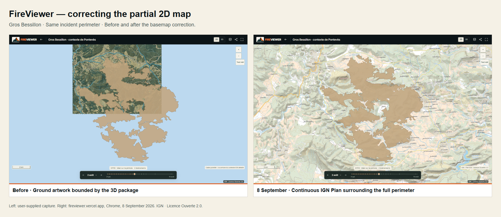
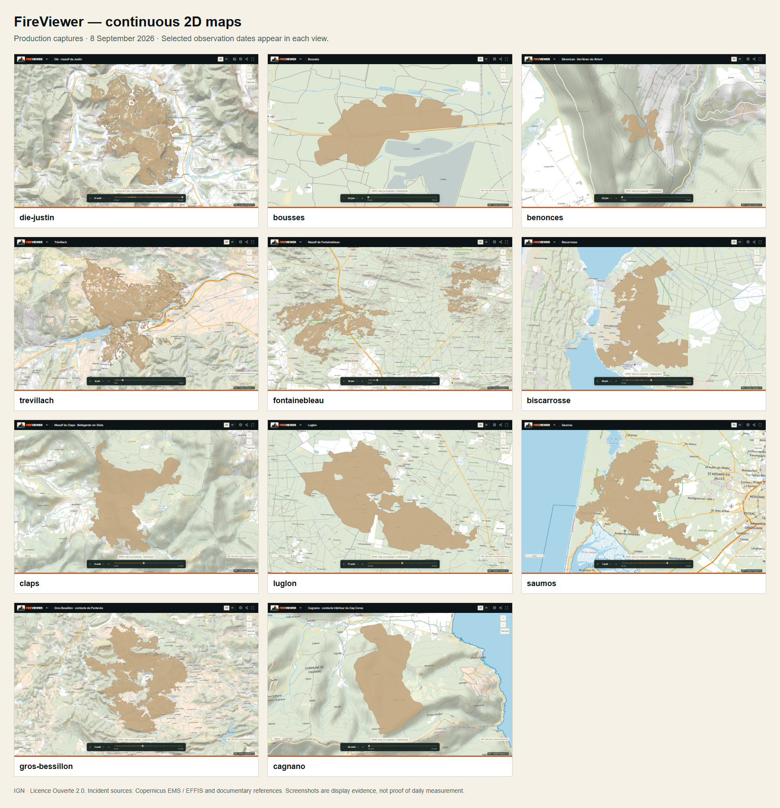
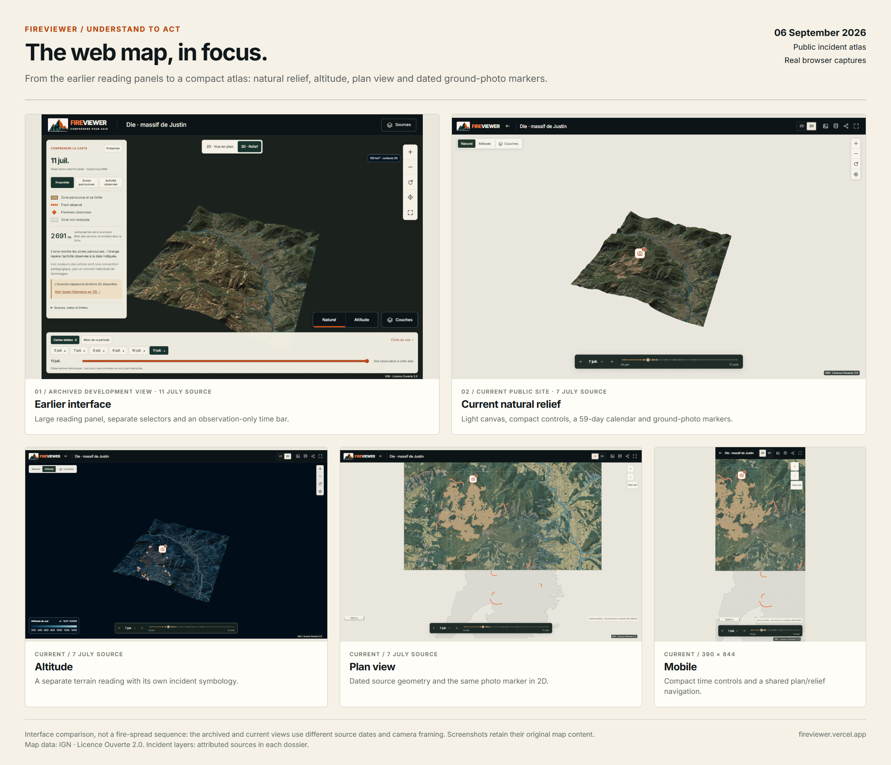
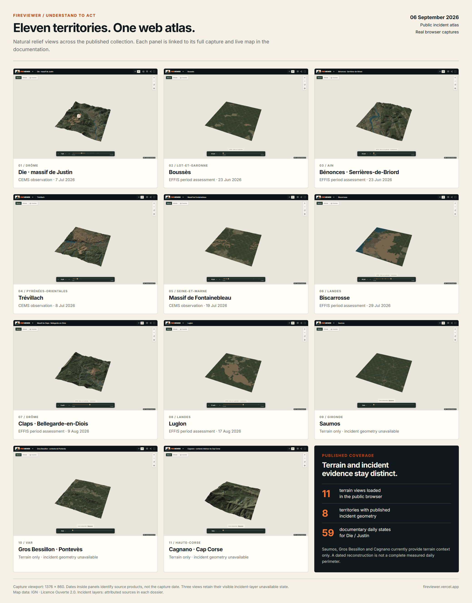

# Web atlas: visual progress and published coverage

**Verified on 8 September 2026 · [Open the incident site](https://fireviewer.vercel.app/incendies).**

The incident atlas connects eleven French territories to their dossiers. Each
territory has a published terrain package, verified in the 6 September browser
review below. All eleven now include incident geometry and a checked chronology archive.

## Continuous 2D coverage: 8 September update

The previous plan view reused the bounded 3D ground artwork, leaving the outer
perimeter on an empty background. The 2D view now requests a continuous
[IGN Plan image](https://data.geopf.fr/wms-r?SERVICE=WMS&VERSION=1.3.0&REQUEST=GetCapabilities)
for the visible extent, reprojected to Lambert-93. Pan, zoom and the full-extent
control retain geographic context beyond the 3D package. The dated incident
geometry is unchanged. The Natural 3D background is sky blue; Altitude is unchanged.

All eleven public 2D maps passed desktop, mobile, pan, zoom and full-extent
checks in Chrome. IGN imagery is an online dependency; a failed request exposes
a compact retry control, also tested locally. A continuous basemap does not
establish continuous observations of the fire.

Full-size 2D captures:

- [die-justin](images/web-maps-2026-09-08/die-justin-desktop.png)
- [bousses](images/web-maps-2026-09-08/bousses-desktop.png)
- [benonces](images/web-maps-2026-09-08/benonces-desktop.png)
- [trevillach](images/web-maps-2026-09-08/trevillach-desktop.png)
- [fontainebleau](images/web-maps-2026-09-08/fontainebleau-desktop.png)
- [biscarrosse](images/web-maps-2026-09-08/biscarrosse-desktop.png)
- [claps](images/web-maps-2026-09-08/claps-desktop.png)
- [luglon](images/web-maps-2026-09-08/luglon-desktop.png)
- [saumos](images/web-maps-2026-09-08/saumos-desktop.png)
- [gros-bessillon](images/web-maps-2026-09-08/gros-bessillon-desktop.png)
- [cagnano](images/web-maps-2026-09-08/cagnano-desktop.png)

Mobile: [Gros Bessillon](images/web-maps-2026-09-08/gros-bessillon-mobile.png)
and [Saumos](images/web-maps-2026-09-08/saumos-mobile.png).

## Dossier enrichment

The owner-authorised, append-only publication adds **22 facts, 46 chronology
events and 37 official links** across the eleven dossiers. Their combined public
contents now include **104 facts and 154 sourced chronology events**. Sources
include prefectures, ONF, departmental authorities and published air-quality
bulletins. Existing incident dates, statuses, reference coordinates and human
review records are preserved. This publication is not an independent human review.

Saumos, Gros Bessillon and Cagnano now have EFFIS period assessments. These are
period summaries, not measured daily perimeters. Saumos CEMS export work is
not included in this verified release; no unvalidated large geometry is served.

## Viewer progress: 6 September archive

The first panel is an archived development capture. The remaining panels are
captures of the public site from 6 September. Selected observation dates are shown in the
image: this is an interface comparison, not a reconstruction of fire spread.

- A compact header and daily time control give the terrain more space. The
  former reading panel and redundant calendar controls have been removed.
- Natural relief uses a light background and a distinct treatment of mapped
  affected ground. Altitude retains its own visual code.
- Plan and relief share dated incident references. Their extent can differ: a
  3D terrain unit is not a claim to cover the entire incident.
- Camera markers open ground photographs with their original date, credit and
  source. Approximate positions identify the photographed sector; photographs
  without a supported location remain in the dossier gallery.
- The chronology can fall back to its checked, published archive when the
  incident API is unavailable.

## Natural 3D gallery: 6 September archive

The archived captures below use natural 3D at **1376 × 860**. Dates identify the selected
source product, not the screenshot date or a current emergency state. EFFIS
period assessments are not independent daily observations.

| Territory | Incident layers | Selected product | Capture | Live atlas |
| --- | --- | --- | --- | --- |
| Die · massif de Justin, Drôme | 67 references: 59 daily reconstructions + 8 source products | CEMS · 7 July | [PNG](images/web-maps-2026-09-06/die-justin-natural.png) | [Open](https://fireviewer.vercel.app/atlas/die-justin?jour=2026-07-07&vue=3d&lecture=situation&carte=emsr890-2632-v2) |
| Boussès, Lot-et-Garonne | 1 reference | EFFIS period assessment · 23 June | [PNG](images/web-maps-2026-09-06/bousses-natural.png) | [Open](https://fireviewer.vercel.app/atlas/bousses) |
| Bénonces · Serrières-de-Briord, Ain | 1 reference | EFFIS period assessment · 23 June | [PNG](images/web-maps-2026-09-06/benonces-natural.png) | [Open](https://fireviewer.vercel.app/atlas/benonces) |
| Trévillach, Pyrénées-Orientales | 3 references | CEMS · 8 July | [PNG](images/web-maps-2026-09-06/trevillach-natural.png) | [Open](https://fireviewer.vercel.app/atlas/trevillach) |
| Massif de Fontainebleau, Seine-et-Marne | 6 references | CEMS · 19 July | [PNG](images/web-maps-2026-09-06/fontainebleau-natural.png) | [Open](https://fireviewer.vercel.app/atlas/fontainebleau) |
| Biscarrosse, Landes | 4 references | EFFIS period assessment · 29 July | [PNG](images/web-maps-2026-09-06/biscarrosse-natural.png) | [Open](https://fireviewer.vercel.app/atlas/biscarrosse) |
| Massif du Claps · Bellegarde-en-Diois, Drôme | 1 reference | EFFIS period assessment · 9 August | [PNG](images/web-maps-2026-09-06/claps-natural.png) | [Open](https://fireviewer.vercel.app/atlas/claps) |
| Luglon, Landes | 1 reference | EFFIS period assessment · 17 August | [PNG](images/web-maps-2026-09-06/luglon-natural.png) | [Open](https://fireviewer.vercel.app/atlas/luglon) |
| Saumos, Gironde | 1 EFFIS reference now published | Archived terrain-only capture | [PNG](images/web-maps-2026-09-06/saumos-natural.png) | [Open](https://fireviewer.vercel.app/atlas/saumos) |
| Gros Bessillon · Pontevès, Var | 1 EFFIS reference now published | Archived terrain-only capture | [PNG](images/web-maps-2026-09-06/gros-bessillon-natural.png) | [Open](https://fireviewer.vercel.app/atlas/gros-bessillon) |
| Cagnano · Cap Corse, Haute-Corse | 1 EFFIS reference now published | Archived terrain-only capture | [PNG](images/web-maps-2026-09-06/cagnano-natural.png) | [Open](https://fireviewer.vercel.app/atlas/cagnano) |

## What the daily sequence establishes

Die / Justin has **59 dated documentary reconstructions, from 24 June to
21 August 2026**, and 37 sourced chronology entries. Its eight original CEMS,
EFFIS and Humida source products remain separate. The cross-source work includes
NASA FIRMS detections and Sentinel-2 acquisitions, with source dates and
retrospective constraints retained.

A complete calendar does **not** establish a complete measured outer perimeter
every day. The initial trace covers only part of the reported initial fire;
later gaps and period assessments retain their limitations. Active observations
are not carried forward as current activity. Reconstructed records remain
documentary, retrospectively constrained and without independent human validation.

This owner-authorised publication is separate from the uncalibrated
[Part.4 pipeline](RECONSTRUCTION.md). It does not qualify unattended publication
or establish daily completeness for the other ten incidents.

## Capture provenance and rights

The 6 September screenshots were taken directly from `fireviewer.vercel.app` in Chrome.
The new 2D screenshots were captured from the same production site on 8 September
at 1376 × 860 (desktop) and 390 × 844 (mobile). The before image is the user-supplied
Gros Bessillon capture. All boards arrange real screenshots without altering map content. All eleven terrain views reached their ready state without
JavaScript exceptions. Die also passed the altitude/plan switches and a
390 × 844 mobile capture without horizontal overflow. This establishes the
captured browser state, not all devices or scientific accuracy.

The earlier panel comes from the retained `first-desktop` development capture.
Screenshots are fitted into the boards without redrawing map content. Additional
originals: [earlier interface](images/web-maps-2026-09-06/die-justin-earlier.png),
[altitude](images/web-maps-2026-09-06/die-justin-altitude.png),
[plan](images/web-maps-2026-09-06/die-justin-plan.png),
[mobile](images/web-maps-2026-09-06/die-justin-mobile.png).

Map attribution remains visible. IGN data retain their Licence Ouverte 2.0
terms; Copernicus and other incident sources retain their stated attribution and
licence. Screenshot publication does not relicense third-party content. Ground
photographs remain referenced at their publishers and are not redistributed here.
